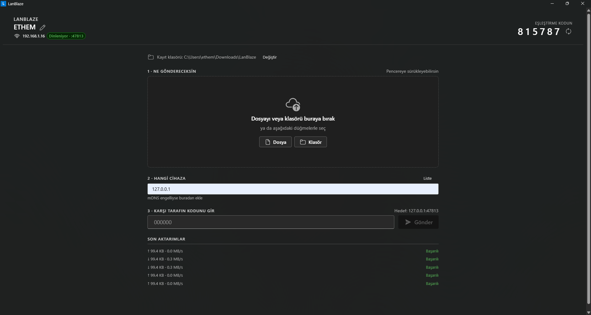

# LanBlaze

**Fast, cloudless file transfer between devices on the same LAN.**
No accounts, no internet round-trip, no relay servers. Built with Tauri 2
(Rust core + React/Fluent UI), aiming to saturate the wire on a single TCP
stream.



---

## Why

Existing tools either round-trip through a cloud service or fall apart on
the "50 000 tiny files" case because they ack every file. LanBlaze is built
around two ideas:

- **One big file:** push it through a single TCP connection with large
  buffers (256 KB chunks, `TCP_NODELAY`); the kernel handles the rest.
- **Many small files:** pipeline them back-to-back over the same stream,
  tar-style — no per-file ack, no RTT tax.

## Features

- **mDNS discovery** — peers appear in a list automatically; no manual IP
  setup unless you want to.
- **6-digit pairing code** — every receiver shows a code; senders must
  enter it. Wrong code → instant reject, no user prompt.
- **blake3 integrity check** end-to-end, with atomic `.part` → final rename.
- **Path-traversal safe** — incoming relative paths are sanitized
  (absolute paths, drive letters, `..` rejected).
- **Resume support** for files ≥ 8 MB — kill the transfer mid-flight,
  restart it, it picks up from the byte that hit disk.
- **Drag and drop** files or folders onto the window.
- **Per-transfer destination** — accept dialog lets you redirect a single
  incoming transfer to a different folder without changing your default.
- **Windows 11 Fluent look** with Mica window background, follows the
  system light/dark theme.

## Quick start

### Install (Windows)

Grab the latest installer from the [Releases](../../releases) page and
run `LanBlaze_<version>_x64-setup.exe`. It installs per-user (no
admin/UAC) and adds a Start menu shortcut.

> On first launch Windows Defender Firewall will pop up asking for network
> access. Check **Private networks** and click **Allow access** — required
> for LAN discovery and the receiver socket.

### Build from source

Requirements: Node.js ≥ 20, Rust stable, Windows with WebView2 runtime.

```bash
npm install
npm run tauri dev          # development
npm run tauri build        # production installer
```

The installer ends up in
`src-tauri/target/release/bundle/nsis/LanBlaze_<version>_x64-setup.exe`.

## How to use it

1. **First run** — pick a device name and a default destination folder.
2. The main screen shows your **6-digit pairing code** in the top-right.
   Share it with the sender.
3. As the sender:
   - drop files/folders onto the window (or use the buttons),
   - pick the destination device from the discovered list (or paste an IP),
   - paste the receiver's 6-digit code,
   - hit **Send**.
4. The receiver gets a dialog showing the sender, file count and total
   size, with an option to redirect this one transfer to a different
   folder. Accept or reject.

### Single-machine loopback test

You can send to yourself for a sanity check: in the manual-IP field type
`127.0.0.1` and paste your own pairing code.

## Protocol (v2)

All multi-byte integers are little-endian. One TCP connection carries the
whole transfer:

```
[u32 hello_len][HELLO JSON]               ← sender → receiver
[u32 ack_len][HELLO_ACK JSON]             ← receiver → sender
repeated per file:
  [u16 path_len][path bytes][u64 size][u8 resumable]
  if resumable == 1:
    [u64 offset]                          ← receiver → sender
  [size - offset bytes of file body]
  [32 bytes blake3 of the full file]
[u16 0]                                   ← end-of-stream
```

`HELLO` carries the sender's device name, OS, file count, total bytes
and the receiver's pairing code. `HELLO_ACK` is `{ accept, reason? }`.
Files below 8 MiB skip the resume handshake to keep the small-files
pipeline at zero extra RTTs.

## Roadmap

- [x] Phase 0 — Tauri 2 + React/TS + Fluent UI scaffold
- [x] Phase 1 — Single-file transfer, blake3, atomic write
- [x] Phase 2 — Many-file / folder pipeline
- [x] Phase 3 — mDNS discovery
- [x] Phase 4 — Setup wizard, pairing code, drag-and-drop, incoming dialog
- [ ] Phase 5 — TLS encryption (optional)
- [x] Phase 6 — Resume for interrupted large-file transfers
- [x] Phase 7 — NSIS installer

## License

Personal project. No license attached yet — ask before redistributing.
